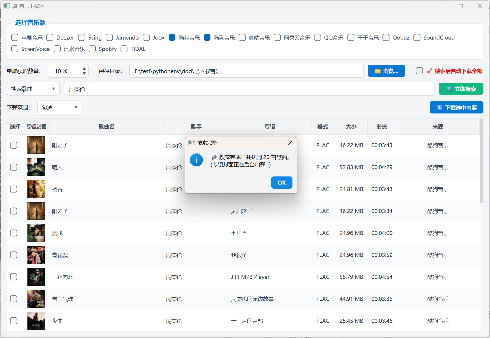
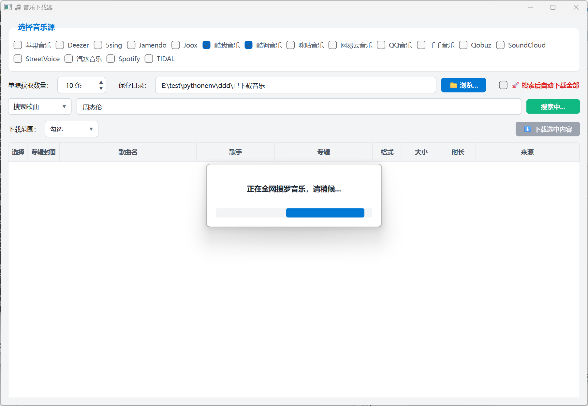
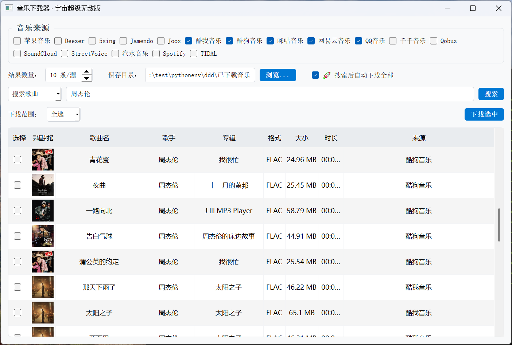

基于 [musicdl](https://github.com/CharlesPikachu/musicdl) 项目做的，基于 [musicdlgui.py](https://github.com/CharlesPikachu/musicdl/blob/master/examples/musicdlgui/musicdlgui.py) 文件修改的，然后用豆包Ai优化了一下界面和功能。


### 软件截图:

<table align="center" border="0" cellpadding="10">

  <tr>
    <td align="center">
      <br>
      <b>图片1</b>
    </td>
    <td align="center">
      <br>
      <b>图片2</b>
    </td>
    <td align="center">
      <br>
      <b>图片3</b>
    </td>
  </tr>
</table>

### 使用教程：

```bash
# 需要用Python3.13
git clone https://github.com/MrsEWE44/musicDownload.git
cd musicDownload
python -m venv gqb313
gqb313\Script\Activate.bat
cd musicDownload
pip install -r requirements.txt
python musicdownload.py 


